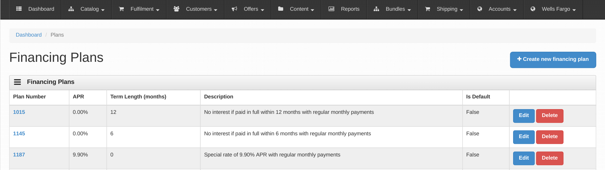

=================
django-oscar-wfrs
=================

An extension on-top of django-oscar-accounts to allow interfacing with Wells Fargo Retail Services.

django-oscar-wfrs is built on top of django-oscar-api and django-oscar-api-checkout.
It will not work with the build-in django-oscar non-ajax checkout.

Installation
============

1. Follow install instructions for django-oscar-bluelight if not done already
2. Install `django-haystack` and ensure a search engine is setup.
3. `pip install django-oscar-wfrs`
4. Add `wellsfargo` to INSTALLED_APPS

You may wish to add wells fargo to OSCAR_DASHBOARD_NAVIGATION. See sandbox/settings.py for an example.

Management Commands
===================

reconcile_wfrs_accounts - can be run as a manage.py command or as a celery task.
We suggest running this a few times a day to fetch the latest account statuses.

Changelog
=========

0.3.0
------------------
- Move API credentials into database, optionally triggered by user group.

0.2.6
------------------
- Add a relation between wellsfargo.AccountMetadata and order.BillingAddress.

0.2.5
------------------
- Prevent creating invalid WFRS Plan Group Benefits in the standard bluelight benefit dashboard.

0.1.0
------------------
- Initial release.

Code Areas of Interest
======================

- connector - Wells Fargo SOAP API integration. Sorry not public `docs <https://docs.google.com/document/d/13Z2GIo10MEoHDdiHApPaZKq3OjFAJN9NCAXt-MfiS-k/edit/>`_.
- api - django-rest-framework based api
- core - django-oscar-wfrs django models
- dashboard - Oscar Dashboard UI extension

Template Tags
=============

- `get_default_plan` returns the default financing plan object
